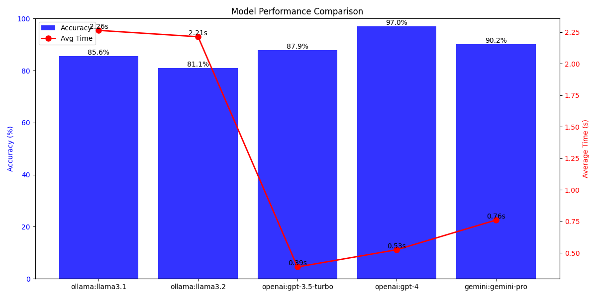

# Financial LLM/ COPA Evaluator

## Project Overview

This project implements a COPA (Choice of Plausible Alternatives) Evaluator, designed to assess and compare the performance of various large language models (LLM's) on Finacial COPA tasks. The COPA task involves selecting the most plausible cause or effect for a given premise from two alternatives.
I'm developing a Financial COPA dataset aimed at comparing the performance and scoring of different LLM's with the purpose of being able to evaluate how they could support a business in reasoning support AI agents for financial scenarios. 

## Features

- Supports evaluation of multiple models from different providers (currently Ollama and OpenAI)
- Calculates accuracy and timing metrics for each model
- Generates a performance comparison graph
- Saves detailed results to a CSV file for further analysis

Example comparison of llama3.2 and openai-3.5-turbo models performance:



## Requirements

- Python 3.6+
- Required Python packages (install via `pip install -r requirements.txt`):
    - requests
    - tqdm
    - openai
    - python-dotenv
    - matplotlib

## Setup

1. Clone this repository
2. Install the required packages: `pip install -r requirements.txt`
3. Create a `.env` file in the project root and add your OpenAI API key:
```, text
OPENAI_API_KEY=your_api_key_here
```
4. Ensure you have Ollama running locally if you plan to use Ollama models

## Usage

1. Prepare your COPA dataset in JSONL format
2. Modify the `models` list in `main.py` to include the models you want to evaluate
3. Run the script: `python main.py`

## Output

- Console output with accuracy and timing metrics for each model
- A CSV file with detailed results for each question
- A PNG image showing a performance comparison graph of all evaluated models

## Customization

- Adjust the `debug` parameter in `COPAEvaluator` initialization to enable/disable detailed output
- Modify the `format_prompt` method to change how prompts are constructed for the models

## Roadmap

- Further develop the validation dataset
  - Focus on financial complexity reasoning only? Decide if the dataset should be pruned to remove superfluous questions not serving the direct COPA.
- Get third party affiration 
  - Academic verification needed for the FCOPA dataset. The current dataset is indicative, not affirmed.
- Add localization
  - Today the FCOPA is based on english datasets. We know for a fact that introducing localization will break the scoring due to lingual training biases

## Contributing

Contributions are welcome! Please feel free to submit a Pull Request.

## License

[MIT License](LICENSE)

## Author
## Stefan Månsby 

stefan@mansby.se

## Credits and inspiration
- The Overlim project (a wonderful project aimed at benchmarking LLM's in Scandinavian languages) https://huggingface.co/datasets/KBLab/overlim
- Dr. Andrew S. Gordon (part of research team who developed COPA) https://asgordon.github.io/

## Why do you need a Financial COPA test, commercial benefits?

Knowing which large language model (LLM) scores the best on financial COPA (Choice of Plausible Alternatives) tests can be highly beneficial in several business scenarios where advanced financial reasoning and comprehension are critical. Here are some scenarios where this knowledge would be valuable:

1. Financial Advisory Services:
- Automated Financial Advisors: Companies offering robo-advisory services can integrate the best-performing LLM to provide more accurate and insightful investment advice.
- Client Interactions: Human financial advisors can use LLMs as support tools to quickly analyze financial scenarios and present plausible alternatives to clients.

2. Banking and Investment Firms:
- Risk Assessment: Banks can utilize top-performing LLMs to assess credit risk, market risk, and operational risk by interpreting complex financial data and predicting plausible outcomes.
- Investment Analysis: Analysts can leverage LLMs to interpret market trends, financial statements, and economic indicators to make informed investment decisions.

3. FinTech Companies:
- Product Development: FinTech firms developing financial products can use the best LLMs to enhance features like budgeting tools, financial planning, and personalized financial recommendations.
- Chatbots and Virtual Assistants: Implementing LLMs that excel in financial reasoning can improve customer service bots, making them more effective in addressing complex financial queries.

4. Regulatory Compliance and Legal Firms:
- Regulatory Interpretation: Firms can employ superior LLMs to interpret regulatory texts, ensuring compliance with financial laws and reducing the risk of legal penalties.
- Fraud Detection: Advanced LLMs can analyze transaction data to detect unusual patterns indicative of fraud or money laundering.

5. Corporate Finance Departments:
- Strategic Planning: Companies can use high-performing LLMs to simulate financial scenarios, aiding in budgeting, forecasting, and strategic decision-making.
- Financial Reporting: LLMs can assist in preparing and analyzing financial reports, ensuring accuracy and compliance with accounting standards.

6. Educational Institutions and Training Providers:
- Curriculum Development: Educators can integrate top-scoring LLMs into learning platforms to provide students with sophisticated financial problem-solving tools.
- Assessment Tools: LLMs can generate complex financial reasoning questions and provide detailed solutions, enhancing the learning experience.

7. Market Research Firms:
- Data Analysis: Firms can utilize the best LLMs to analyze large datasets, extracting meaningful insights about market trends and consumer behavior.
- Report Generation: Automated generation of comprehensive financial reports and summaries becomes more reliable with superior LLMs.

8. Insurance Companies:
- Underwriting: LLMs that excel in financial reasoning can improve risk assessment in underwriting processes.
- Claims Processing: Efficient interpretation of claims data and financial implications can be enhanced with better-performing models.

9. Accounting and Audit Firms:
- Anomaly Detection: Advanced LLMs can identify inconsistencies or anomalies in financial records, aiding in audits.
- Regulatory Compliance: Ensuring that financial statements comply with the latest accounting standards and regulations.

10. Wealth Management:
- Personalized Financial Planning: Advisors can offer tailored investment strategies using insights from the best LLMs.
- Portfolio Optimization: LLMs can help in constructing and adjusting investment portfolios based on complex financial reasoning.

11. Mergers and Acquisitions (M&A):
- Due Diligence: LLMs can assist in the thorough analysis of financial documents during M&A activities.
- Valuation Analysis: Providing plausible financial projections and valuations for target companies.

12. Venture Capital and Private Equity:
- Investment Decisions: Firms can leverage LLMs to evaluate the financial viability of startups and businesses seeking investment.
- Risk Mitigation: Advanced analysis of financial models to identify potential risks.

13. Government and Policy Making:
- Economic Forecasting: Governments can use top-performing LLMs for economic planning and forecasting.
- Policy Impact Analysis: Understanding the financial implications of proposed regulations or policies.

